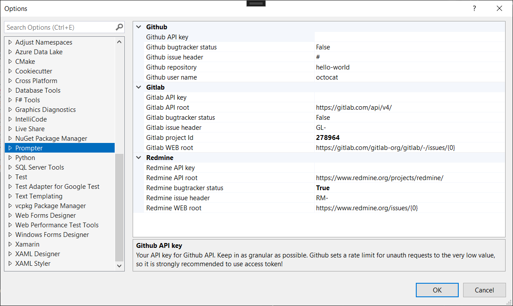

# Bug Tracker Prompter

A Visual Studio Extension to show the links to your bug tracker directly in your code.

At the time Github, Gitlab, and Redmine are supported. You can enable\disable any issue tracker and choose the prefix for each.

